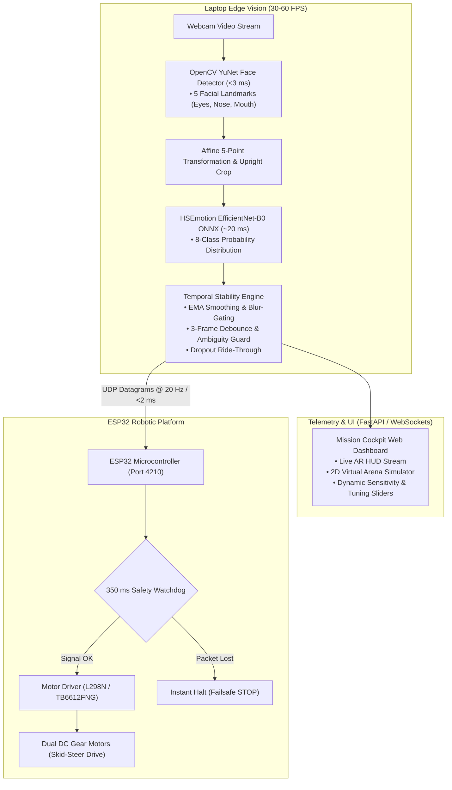

# AI Face Emotion-Controlled Autonomous Robot

[](https://www.python.org/)
[](https://opencv.org/)
[](https://onnxruntime.ai/)
[](https://fastapi.tiangolo.com/)
[](https://espressif.com/)
[](#-verification--test-suite)
[](LICENSE)

An end-to-end, edge-AI robotic steering system that tracks human facial expressions in real-time using high-accuracy Deep Learning models on a laptop webcam and directs an ESP32-driven robotic vehicle over ultra-low-latency Wi-Fi UDP.

Includes a live **Cyberpunk Mission Cockpit** web interface featuring an Augmented Reality (AR) HUD, 2D Virtual Arena simulation, live telemetry meters, dynamic emotion-to-action remapping, and an emergency stop dead-man watchdog.

---

## Table of Contents

- [System Architecture](#-system-architecture)
- [Deep Learning Models & Training Datasets](#-deep-learning-models--training-datasets)
- [Perception Stability & Glitch-Free Pipeline](#-perception-stability--glitch-free-pipeline)
- [Motion Mapping & State Machine](#-motion-mapping--state-machine)
- [Hardware Bill of Materials & Wiring](#-hardware-bill-of-materials--wiring)
- [ESP32 Firmware Flashing](#-esp32-firmware-flashing)
- [Software Installation & Execution](#-software-installation--execution)
- [Mission Cockpit Dashboard](#-mission-cockpit-dashboard)
- [Communication Protocol](#-communication-protocol)
- [Verification & Test Suite](#-verification--test-suite)
- [Project Directory Structure](#-project-directory-structure)
- [Troubleshooting & FAQ](#-troubleshooting--faq)

---

## 🏗 System Architecture

The pipeline processes webcam frames through a two-stage computer vision architecture, stabilizes the emotional state via temporal hysteresis, and dispatches sub-millisecond UDP datagrams to the robot:



---

## 🧠 Deep Learning Models & Training Datasets

The vision architecture separates face detection and landmark localization from affective classification to deliver high accuracy and sub-30ms total inference latency:

### 1. Face Detector: OpenCV YuNet (`face_detection_yunet_2023mar.onnx`)
* **Role:** Detects bounding boxes and 5 facial landmark points (left eye, right eye, nose tip, left mouth corner, right mouth corner) in `<3 ms`.
* **Architecture:** Ultra-lightweight anchor-free convolutional network designed by OpenCV and SUSTech.
* **Pre-trained Dataset:** **[WIDER FACE](http://shuoyang1213.me/WIDERFACE/)**
  * **32,203 high-resolution images** across 61 scene/event categories.
  * **393,703 manually annotated faces** covering extreme variations in scale, pose, occlusions, and illumination.
  * Augmented with 5-point facial landmarks for geometric head pose estimation and rotation correction.
* **Fallback:** Haar Feature-based Cascade Classifier (`haarcascade_frontalface_default.xml`).

### 2. Emotion Classifier: HSEmotion EfficientNet-B0 (`enet_b0_8_best_vgaf`)
* **Role:** Classifies the aligned, cropped face into 8 emotional classes in `~20 ms` on CPU.
* **Architecture:** EfficientNet-B0 backbone optimized for ONNX Runtime inference.
* **Multi-Stage Training Pipeline:**
  1. **Stage 1 (Feature Extraction):** Pre-trained on **VGGFace2** (**3.31 million images** across 9,131 identities) to learn generalized facial structures and identity invariance.
  2. **Stage 2 (Primary Emotion Training):** Trained on **AffectNet** (the largest real-world facial emotion database in the wild) with **over 1,000,000 images** gathered from the web, and **~450,000 manually annotated images** (~287,000 images across 8 categorical emotion classes).
  3. **Stage 3 (Temporal / Real-World Fine-Tuning):** Evaluated and fine-tuned on the **VGAF (Video-level Group AFfect)** and **AFEW (Acted Facial Expressions in the Wild)** datasets (2,661+ dynamic video clips) to eliminate frame-to-frame flicker and false activations in video streams.

---

## 🛡 Perception Stability & Glitch-Free Pipeline

Raw neural network frame-by-frame outputs can flicker due to webcam noise, motion blur, and slight shifts in head angle. This system incorporates an engineering layer to ensure fluid robot movements:

* **Bounding Box & Landmark EMA Smoothing:** Eliminates 1–2 px detection jitter so the cropped face sent to the emotion classifier remains rock-steady.
* **Snap-on-Jump Detection:** Uses Intersection-over-Union (IoU) gating. When a new person enters or rapid movement occurs, the tracker snaps instantly rather than sluggishly dragging the bounding box.
* **Contrast-Normalized Blur Gating:** Computes a normalized Laplacian variance across the crop. If motion blur drops below the sharpness threshold ($< 5.0$), probabilities are damped toward *Neutral* instead of causing erratic commands.
* **Adaptive Low-Light CLAHE:** Applies Contrast Limited Adaptive Histogram Equalization if face crop luminance drops below 70, preventing underexposed webcam frames from dropping accuracy.
* **3-Frame Debounce & Hysteresis:** An expression must be held steadily for 3 consecutive frames before the robot changes movement states, filtering out micro-expressions, sneezes, or blinks.
* **Zero-Dip Directional Crossfading:** Deliberately switching expressions (e.g., Happy $\rightarrow$ Angry) transitions directly (`FORWARD` $\rightarrow$ `LEFT`) without stuttering into an intermediate `STOP`.
* **Dropout Ride-Through:** If the webcam drops 1–3 frames (40–120 ms), the robot holds the active motion command instead of jittering. If face loss exceeds the threshold, the system immediately failsafes to `STOP`.
* **Smooth & Precise Turns:** Dedicated turning speed (PWM 130 vs 200) with instant on-a-dime halting upon expression relaxation to prevent rotational overshoot.

---

## 🎮 Motion Mapping & State Machine

| Facial Expression | Emotional State | Default Robot Action | Wheel Behavior (Skid-Steer) | Default PWM |
| :--- | :--- | :--- | :--- | :--- |
| **Happy** | Smile / Joy | `FORWARD` | Both motors rotate forward | 200 / 255 |
| **Sad** | Frown / Melancholy | `BACKWARD` | Both motors rotate backward | 180 / 255 |
| **Angry** | Furrowed Brow / Scowl | `LEFT` | Left wheels reverse, right wheels forward | 130 / 255 |
| **Surprised** | Open Mouth / Wide Eyes | `RIGHT` | Left wheels forward, right wheels reverse | 130 / 255 |
| **Neutral / No Face** | Rest / Inactive | `STOP` | All motors powered down | 0 |

> [!NOTE]
> All emotion-to-action bindings, confidence thresholds, and motor speeds can be remapped dynamically in real-time through the Mission Cockpit web dashboard.

---

## 🔌 Hardware Bill of Materials & Wiring

### 1. Hardware Requirements
* **Microcontroller:** ESP32 Dev Module (ESP32-WROOM-32 / NodeMCU-32S / ESP32-CAM)
* **Motor Driver:** L298N Dual H-Bridge (or TB6612FNG / DRV8833)
* **Chassis & Motors:** 2WD or 4WD robotic chassis with DC gear motors
* **Power Source:** 
  * 7.4V (2S Li-ion 18650) or 11.1V (3S LiPo) to power the motor driver
  * 5V USB power bank or onboard buck converter to power the ESP32
* **Webcam:** Laptop integrated webcam or USB HD webcam

### 2. Wiring Pinout Diagram (ESP32 $\leftrightarrow$ L298N)

| ESP32 Pin | L298N Driver Pin | Description | Logic / Signal |
| :---: | :---: | :--- | :---: |
| **GPIO 14** | `ENA` | Left Motor Speed Control | 8-bit PWM (1 kHz) |
| **GPIO 27** | `IN1` | Left Motor Direction Pin 1 | Digital GPIO |
| **GPIO 26** | `IN2` | Left Motor Direction Pin 2 | Digital GPIO |
| **GPIO 12** | `ENB` | Right Motor Speed Control | 8-bit PWM (1 kHz) |
| **GPIO 25** | `IN3` | Right Motor Direction Pin 1 | Digital GPIO |
| **GPIO 33** | `IN4` | Right Motor Direction Pin 2 | Digital GPIO |
| **GND** | `GND` | **Common Ground** (Must tie to Battery GND) | Ground Reference |
| **VIN / 5V** | `5V` | ESP32 Power Supply | 5V DC |

> [!CAUTION]
> **Common Ground is mandatory:** Connect the ESP32 `GND`, motor driver `GND`, and battery negative terminal together. Never draw high-current motor power directly from the ESP32 3.3V power rails.

---

## ⚡ ESP32 Firmware Flashing

The firmware (`esp32_firmware/esp32_robot_firmware.ino`) features **dual networking modes** (automatic connection to your Wi-Fi router, with instant fallback to a local SoftAP hotspot if no Wi-Fi is available).

1. Open **Arduino IDE** (or PlatformIO).
2. Install the ESP32 Board Package via **Tools** $\rightarrow$ **Board** $\rightarrow$ **Boards Manager** $\rightarrow$ Search `esp32` by Espressif.
3. Open [`esp32_firmware/esp32_robot_firmware.ino`](esp32_firmware/esp32_robot_firmware.ino).
4. (Optional) Enter your local Wi-Fi router or mobile hotspot credentials:
   ```cpp
   const char* STA_SSID     = "YOUR_WIFI_SSID";
   const char* STA_PASSWORD = "YOUR_WIFI_PASSWORD";
   ```
   *If connection to your network fails, the ESP32 automatically generates its own standalone Wi-Fi hotspot:*
   * **SSID:** `Robot-Emotion-AP`
   * **Password:** `12345678`
   * **Default IP:** `192.168.4.1`
5. Select your ESP32 board and COM port, then click **Upload**.
6. Open the **Serial Monitor (115200 baud)** to note the assigned IP address.

---

## 💻 Software Installation & Execution

### 1. Prerequisites
* Python 3.10, 3.11, or 3.12
* Git

### 2. Setup Virtual Environment
```powershell
# Clone repository
git clone https://github.com/Snuc-Potential-Robotics/Bot-Face-Recognition.git
cd Bot-Face-Recognition

# Create and activate virtual environment
python -m venv venv
.\venv\Scripts\Activate.ps1  # On Windows PowerShell
# source venv/bin/activate    # On Linux / macOS
```

### 3. Install Python Dependencies
```powershell
pip install -r requirements.txt
```

### 4. Launch the Application
```powershell
python main.py
```
*The Mission Cockpit dashboard will automatically launch in your default web browser at `http://127.0.0.1:8000`.*

#### Command-Line Arguments
| Flag | Type | Default | Description |
| :--- | :---: | :---: | :--- |
| `--camera` | `int` | `0` | Webcam device index |
| `--esp32-ip` | `str` | `192.168.4.1` | Destination IP address of the ESP32 |
| `--esp32-port` | `int` | `4210` | Destination UDP port for robot commands |
| `--host` | `str` | `127.0.0.1` | Web dashboard host interface |
| `--port` | `int` | `8000` | Web dashboard HTTP port |
| `--no-browser` | `flag` | `False` | Disables automatic browser launch |

*Example connecting directly to an ESP32 on a local home network:*
```powershell
python main.py --camera 0 --esp32-ip 192.168.1.145 --esp32-port 4210
```

---

## 🎛 Mission Cockpit Dashboard

Once launched, navigating to `http://localhost:8000` presents an interactive, cyberpunk-inspired control station:

1. **Augmented Reality (AR) HUD Feed:**
   * Live webcam stream with 5-point facial landmark crosshairs and face tracking reticle.
   * Real-time inference latency (ms), detection FPS, and active emotion indicator badge.
2. **2D Virtual Arena Simulator:**
   * Built-in HTML5 canvas simulating robot heading and motion in real-time.
   * Enables complete end-to-end verification of expressions and steering without needing physical hardware connected.
3. **Motion Compass & Probability Bars:**
   * 360° motion compass highlighting active skid-steer vector (`FORWARD`, `BACKWARD`, `LEFT`, `RIGHT`, `STOP`).
   * Dynamic real-time probability meters for all 8 emotional classes.
4. **Emergency Stop & Manual Override:**
   * Press **`[SPACEBAR]`** or click the red **EMERGENCY STOP** button to immediately halt the robot.
   * Toggle **Manual Override** to steer using keyboard inputs (**W, A, S, D**) or virtual D-Pad buttons.
5. **Interactive Tuning & Remapping:**
   * Live sliders to adjust confidence activation thresholds and motor speeds (PWM 0–255).
   * Update the ESP32 IP address and UDP port directly from the UI without restarting Python.

---

## 📡 Communication Protocol

The system transmits lightweight datagrams over non-blocking UDP at **20 Hz** to guarantee minimal network overhead and avoid Wi-Fi buffer bloat.

### 1. Compact UDP Datagram Format
Designed for minimal parsing overhead on microcontrollers:
```text
CMD:SPEED:SEQ\n
```
* **`CMD`**: Single character identifier (`F` = Forward, `B` = Backward, `L` = Left, `R` = Right, `S` = Stop).
* **`SPEED`**: Integer PWM power value (`0` – `255`).
* **`SEQ`**: Incremental packet counter to track packet loss and jitter.
* *Example:* `"F:200:1042\n"` $\rightarrow$ Forward at PWM 200, sequence packet #1042.

### 2. JSON Telemetry Format (WebSockets)
```json
{
  "cmd": "F",
  "action": "FORWARD",
  "spd": 200,
  "emo": "Happy",
  "conf": 0.94,
  "seq": 1042,
  "ts": 1726938921.412
}
```

### 3. Fail-Safe Watchdog
The ESP32 firmware continuously tracks packet timestamps. If no valid UDP datagram is received within **350 ms** (e.g., computer disconnects, webcam goes dark, or Wi-Fi drops), the motors are immediately killed.

---

## 🧪 Verification & Test Suite

The project includes an automated test suite verifying computer vision stability, edge cases, temporal smoothing, and UDP network serialization:

```powershell
# Run all unit tests
python -m unittest discover -s tests -v
```

### Coverage Highlights
* **Vision Edge Cases:** Single-channel grayscale, 4-channel BGRA, non-standard aspect ratios (16:9, 1:1, 9:16 vertical), pitch-black frames, overexposed white frames, low-light CLAHE validation.
* **Temporal Smoothing & Stability:** EMA jitter reduction, large-jump snap handling, blur-gate Neutral damping, 2-frame burst rejection, 3-frame debounce activation, zero-dip directional crossfading.
* **Precision Turn Mechanics:** Right/left turn immediate halt upon relaxation, tight turn dropout grace to prevent blind spinning, turn-speed constraint testing.
* **UDP Networking:** Compact string serialization, JSON serialization, non-blocking transmission loops.

---

## 📂 Project Directory Structure

```text
Bot_Face_recog/
├── esp32_firmware/
│   └── esp32_robot_firmware.ino    # ESP32 C++ firmware (Dual Wi-Fi, Watchdog, PWM)
├── models/
│   └── face_detection_yunet_2023mar.onnx  # Pre-trained YuNet ONNX weights
├── src/
│   ├── comm/
│   │   ├── protocol.py             # Serialization & RobotCommand dataclass
│   │   └── udp_transmitter.py      # Background thread UDP socket transmitter
│   ├── core/
│   │   ├── detector.py             # YuNet detection, 5-point alignment & tracker
│   │   ├── emotion_engine.py       # HSEmotion AffectNet ONNX inference engine
│   │   └── temporal_smoother.py    # Debouncing, EMA smoothing & safety logic
│   ├── static/
│   │   ├── app.js                  # Frontend WebSocket client, telemetry & HUD
│   │   ├── index.html              # Cyberpunk Mission Cockpit web interface
│   │   └── style.css               # Futuristic HUD styling & layout
│   └── web/
│       └── server.py               # FastAPI backend, MJPEG stream & REST APIs
├── tests/
│   ├── benchmark_robustness.py     # Latency & throughput stress benchmarking
│   ├── test_edge_cases_network.py  # Packet drop & malformed UDP tests
│   ├── test_edge_cases_smoother.py # Jitter, burst & ambiguity edge cases
│   ├── test_edge_cases_vision.py   # Lighting, dimension & corrupt frame tests
│   ├── test_emotion_engine.py      # AffectNet model tensor tests
│   ├── test_smoother.py            # Basic temporal debouncer tests
│   ├── test_stability.py           # Deep stability, blur-gating & turn tests
│   └── test_udp_comm.py            # Network datagram validation tests
├── main.py                         # Application CLI entry point
├── requirements.txt                # Python package dependencies
└── README.md                       # Comprehensive documentation
```

---

## ❓ Troubleshooting & FAQ

<details>
<summary><b>1. The robot is not moving when I smile or frown</b></summary>

* Check the **Confidence Threshold** in the Mission Cockpit dashboard (default is `0.65`). If your room has low lighting, lower it to `0.50`.
* Confirm the ESP32 IP address entered in the dashboard matches the IP printed on the Arduino Serial Monitor.
* Verify common ground between your battery, motor driver, and ESP32.
</details>

<details>
<summary><b>2. Webcam is opening the wrong camera</b></summary>

* Run with `--camera 1` (or `--camera 2`) to select an external USB webcam:
  ```powershell
  python main.py --camera 1
  ```
</details>

<details>
<summary><b>3. The robot turns in the opposite direction</b></summary>

* Swap the polarity of the DC motor wires on the L298N terminal blocks (`OUT1`/`OUT2` for left, `OUT3`/`OUT4` for right), or invert the mapping inside the Mission Cockpit dashboard.
</details>

<details>
<summary><b>4. How to connect directly to the robot without a Wi-Fi router</b></summary>

* Leave the default Wi-Fi credentials blank in the firmware. Power the ESP32 on.
* Connect your laptop's Wi-Fi to the network named `Robot-Emotion-AP` (Password: `12345678`).
* Launch `python main.py --esp32-ip 192.168.4.1`.
</details>

---

## 📜 License

This project is licensed under the [MIT License](LICENSE).
